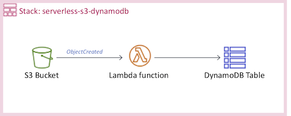

# Create a Serverless project

Work inside your AWS Cloud9 or local environment.



## Configure your environment

* In AWS Cloud9 configure the AWS CLI using the local credentials, and set the region name to **`us-east-1`** and the output format to **`json`**. 

``` bash
aws configure
```

* In your local environment [configure the AWS CLI](https://docs.aws.amazon.com/cli/latest/userguide/cli-chap-configure.html#cli-quick-configuration).

## Install dependencies

Install Serverless CLI tool https://serverless.com/framework/docs/providers/aws/guide/installation/

``` bash
npm install -g serverless
```

## Create a Serverless project

``` bash
serverless create --template aws-python --path serverless-textract
cd serverless-textract
pip install -r requirements.txt -t .
```

Replace your **handler.py** with the file [handler.py](handler.py).

Replace your **serverless.yml** with the file [serverless.yml](serverless.yml), change the **bucketName** with your own alias name.

Install the last version for Boto 3 using the **requirements.txt** file.

``` bash
wget 
pip install -r requirements.txt -t .
```

## Deploy your Serverless project

``` bash
serverless deploy
```

## Testing

Upload **png**, **jpg** or **pdf** documents to your S3 bucket created, few seconds later a json file with the result will be created.
