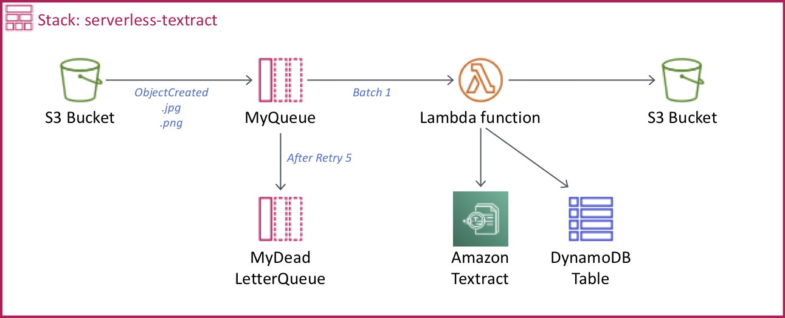

# Create a Serverless project to use Textract

Work inside your AWS Cloud9 or local environment.



## Configure your environment

* In AWS Cloud9 configure the AWS CLI using the local credentials, and set the region name to **`us-east-1`** and the output format to **`json`**. 

``` bash
aws configure
```

* In your local environment [configure the AWS CLI](https://docs.aws.amazon.com/cli/latest/userguide/cli-chap-configure.html#cli-quick-configuration).

## Install dependencies

Update Node.js to the minimal version of 8.

``` bash
nvm i v8
```

Install Serverless CLI tool https://serverless.com/framework/docs/providers/aws/guide/installation/

``` bash
npm install -g serverless
```

## Create a Serverless project

``` bash
serverless create --template aws-python --path serverless-textract
cd serverless-textract
```

Replace your **handler.py** with the file [handler.py](handler.py).

Replace your **serverless.yml** with the file [serverless.yml](serverless.yml), change the property **bucketNameDocs** with your own alias name for the bucket.

## Deploy your Serverless project

``` bash
serverless deploy
```

## Testing

Upload a **png**, **jpg** or **pdf** document to your S3 bucket created, few seconds later a json file with the result will be created.
